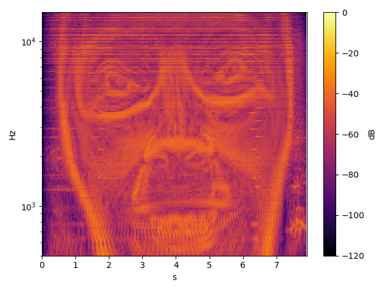

# Sliding Discrete Fourier Transform (SDFT)


Forward and inverse SDFT according to [[1]](#1) and [[2]](#2) with following goodies:

- Arbitrary number of DFT bins
- Hann window at analysis
- Single or multiple sample processing at once
- Continuous data processing without resets
- Optional synthesis latency control parameter

## Usage

### C

```c
#define SDFT_TD_FLOAT  // time domain data type (float by default)
#define SDFT_FD_DOUBLE // frequency domain data type (double by default)

#include <sdft/sdft.h> // see also src/c folder

size_t n = ...; // number of samples
size_t m = ...; // number of dft bins

float* x = ...; // analysis samples of shape (n)
float* y = ...; // synthesis samples of shape (n)

double complex* dft = ...; // dft matrix of shape (n, m)

sdft_t* sdft = sdft_alloc(m); // create sdft plan

sdft_sdft_n(sdft, n, x, dft); // extract dft matrix from input samples
sdft_isdft_n(sdft, n, dft, y); // synthesize output samples from dft matrix

sdft_free(sdft); // destroy sdft plan
```

Due to incomplete C complex math support in MSVC, optionally use following universal typedefs:

* `sdft_float_t` instead of `float`
* `sdft_double_complex_t` instead of `double complex`

or even better the corresponding generic typedefs:

* `sdft_td_t`
* `sdft_fdx_t`

In both cases, the underlying data type results from the `SDFT_TD_*` and `SDFT_FD_*` definitions.

### C++

```c++
#include <sdft/sdft.h> // see also src/cpp folder

size_t n = ...; // number of samples
size_t m = ...; // number of dft bins

float* x = ...; // analysis samples of shape (n)
float* y = ...; // synthesis samples of shape (n)

std::complex<double>* dft = ...; // dft matrix of shape (n, m)

SDFT<float> sdft(m); // create sdft plan with time/frequency domain data type

sdft.sdft(n, x, dft); // extract dft matrix from input samples
sdft.isdft(n, dft, y); // synthesize output samples from dft matrix
```

Optionally specify a different frequency domain data type like so `SDFT<float, double>`.

### Python

```python
from sdft import SDFT # see also src/python folder

n = ... # number of samples
m = ... # number of dft bins

x = ... # analysis samples of shape (n)

sdft = SDFT(m) # create sdft plan

dft = sdft.sdft(x) # extract dft matrix from input samples
y = sdft.isdft(dft) # synthesize output samples from dft matrix
```

Feel free to obtain the current version from the PyPI `pip install sdft`.

## Test spectrogram (test.wav)

| SDFT | STFT |
| ---- | ---- |
|  |  |

## Implementation details

- The C/C++ implementation corresponds to figure 4 in [[1]](#1).
- The Python implementation corresponds to figure 3b in [[1]](#1).

## References

1. <span id="1">Krzysztof Duda (2010). Accurate, Guaranteed Stable, Sliding Discrete Fourier Transform. IEEE Signal Processing Magazine. https://ieeexplore.ieee.org/document/5563098</span>

2. <span id="2">Russell Bradford et al. (2005). Sliding is Smoother Than Jumping. International Computer Music Conference Proceedings. http://hdl.handle.net/2027/spo.bbp2372.2005.086</span>

## License

This *sdft* implementation is licensed under the terms of the MIT license.
For details please refer to the accompanying [LICENSE](LICENSE) file distributed with it.
